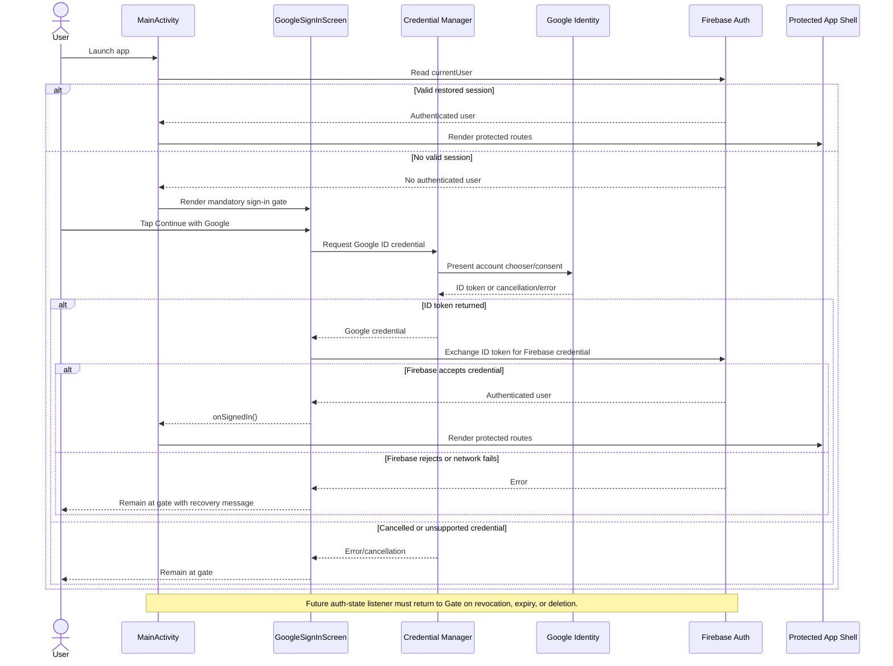

# Authentication Flow and Security Contract

## Scope

The app has a mandatory Google-account sign-in gate. A user must have a valid Firebase Authentication session before the Mentor, 3D model, manual, diagnostics, OBD-II/FORScan, or saved technician-record features can be used.

## Sequence diagram

## State and recovery table

| State | Trigger | Required behavior | Recovery |
|---|---|---|---|
| `SIGNED_OUT` | Fresh install, sign-out, or no cached session | Render only the Google gate | Start Google sign-in |
| `SIGN_IN_PENDING` | User starts sign-in | Disable duplicate sign-in requests and show progress | Complete or cancel provider flow |
| `SIGNED_IN` | Firebase accepts Google ID token | Render protected shell | Continue using provider-managed session |
| `CANCELLED` | User closes account chooser | Remain signed out | Retry sign-in |
| `CONFIGURATION_ERROR` | Missing Firebase config or web client ID | Remain signed out; show actionable setup error | Configure Firebase and rebuild |
| `NETWORK_ERROR` | Provider or Firebase request cannot reach network | Remain signed out unless a valid provider session is already restored | Restore network and retry |
| `INVALID_CREDENTIAL` | Unsupported or malformed credential | Remain signed out; do not open protected routes | Retry with an approved Google account |
| `REVOKED_OR_EXPIRED` | Firebase session is invalidated remotely | Fail closed and return to gate | Reauthenticate |
| `ACCOUNT_SWITCH` | User signs out and chooses another account | Clear prior app session state and load only the new account’s data | Authenticate the new account |

## Current implementation contract

`GoogleAuthManager` obtains a Google credential with Android Credential Manager and exchanges the ID token through `GoogleAuthProvider`. `MainActivity` renders `FeatureLaunchShell` only when `GoogleAuthManager.isSignedIn()` is true. The manager serializes concurrent sign-in attempts with a coroutine mutex and cancels the Firebase task when its coroutine is cancelled.

The current implementation has two explicitly tracked follow-ups. The UI must subscribe to Firebase authentication-state changes so token expiry, remote revocation, and account deletion immediately return to the gate. The protected shell must expose a visible sign-out/account-switch action before physical acceptance is declared complete.

## Security considerations

- Google passwords are never collected or stored by the app.
- Google ID tokens are passed to Firebase Auth and are not written to app preferences.
- The web OAuth client ID is configuration, not a substitute for Firebase project validation.
- `google-services.json` and local Secrets values must not be committed with private project material.
- Authentication proves identity but does not authorize a mechanical repair or prove that a vehicle is safe to drive.
- Diagnostic records must be keyed to the authenticated Firebase user before multi-user release.
- The app must fail closed when configuration, credentials, or network state prevents authentication.
- Logs and screenshots must redact email addresses, tokens, VINs, and other personal or vehicle-identifying data.
- OBD-II/FORScan functionality must remain read-only unless a separate, explicitly tested safety contract authorizes a command.
- Test accounts should be dedicated accounts with minimum project permissions.

## Acceptance boundary

Build success is not authentication acceptance. Acceptance requires a configured Firebase project and physical-device execution of fresh install, cancellation, successful sign-in, session restore, sign-out, account switch, revocation, offline startup, protected-route, and account-data separation tests.

## References

[1]: https://firebase.google.com/docs/auth/android/google-signin "Firebase Google Sign-In for Android"
[2]: https://developer.android.com/identity/sign-in/credential-manager "Android Credential Manager"
